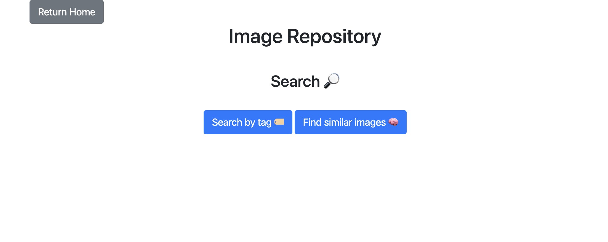
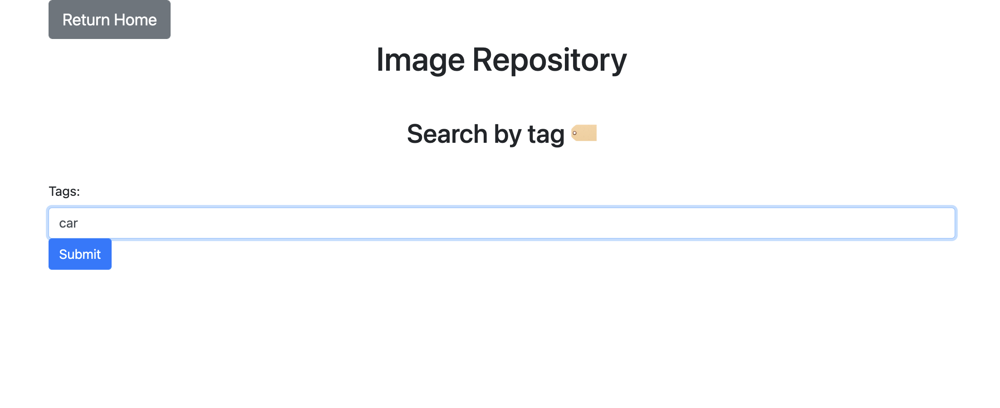
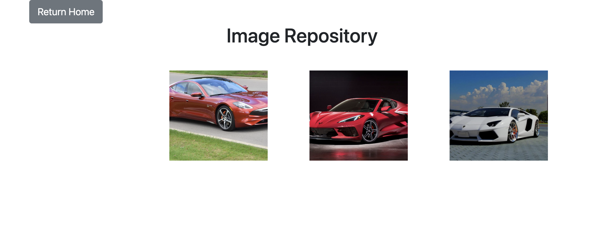
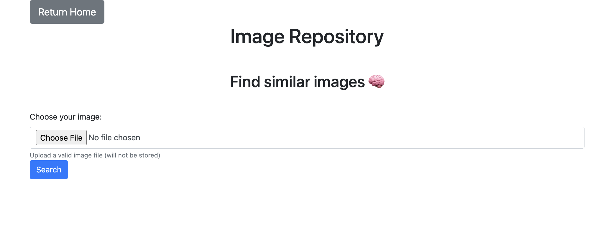
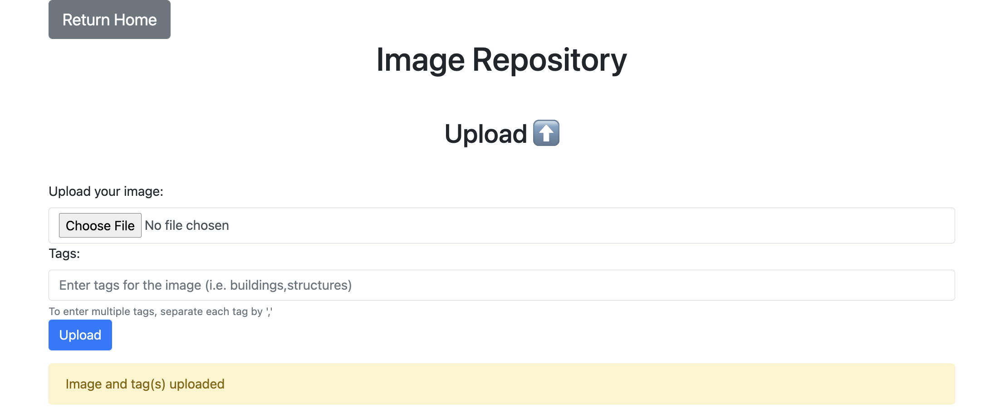

# Shopify F22 Data Engineer Intern Challenge

The following code base implements the image repository from the [Shopify Data Engineer Intern](https://docs.google.com/document/d/1ijXrqQMOORukOWCWcwwcpxPcF_TczwvNE0wB4M2Orqg/edit#heading=h.n7bww7g70ipk) document.

Live Demo (might be down)
: [link](https://babrar-image-repo-shopify.herokuapp.com/home)  

## Instructions

The project has been containerized. Just run the following commands:

```sh
docker build -t image_repo:latest .
docker run -p 5000:5000 image_repo
```

Then visit `http://localhost:5000/` on your browser to test it out.

## What was done

- I chose to fully implement the **SEARCH** functionality. More on this later.

- I have also partly implemeted the **ADD** functionality for testing purposes. No bulk upload/secure storage features were implemented.

## What's cool about it?

1. Searching images by similarity was an open-ended design choice. I chose **not** to use ML libraries due to added complexity. Rather, I computed [perceptual image hashes](https://en.wikipedia.org/wiki/Perceptual_hashing) to compare image similarity. It's not perfect, but it's simple and performant.
2. I tried to extract tags both from the user input and the filename. That should allow for more accurate tag searching.

## How does it work?

### Homepage


### Search

Now you have two options to search images by:


#### By tag

Searching by 'car' as an example...

Result:


#### By similarity

Similarly, one can search by similarity. Upload a photo to find corresponding similar images in the repository.


### Upload

Successful uploads will show up as the following:


## Dev Documentation

The program has been written in Flask and uses a simple MVC model.
There are separate directories for the models, views (templates) and the controllers.

Most functions have been well documented in code using comments. Due to the small nature of the program, the code base is self-documenting.

## Things I skipped

Due to time constaints, I couldn't add test cases and had to rely on testing the app through the UI.
